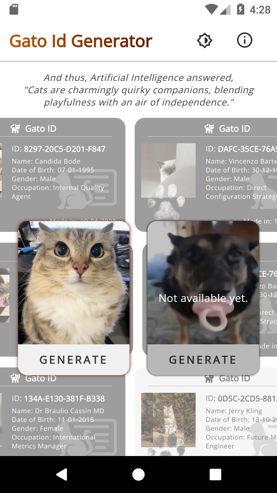
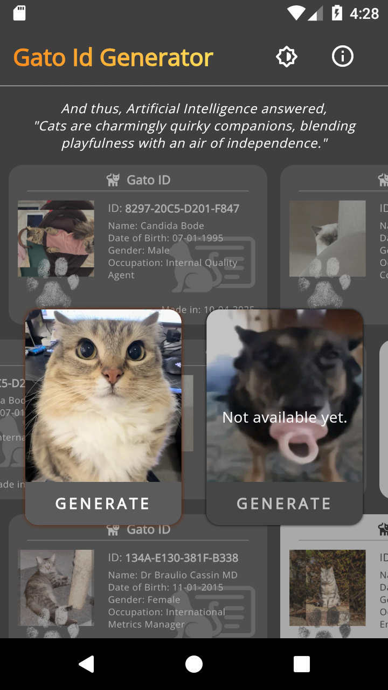
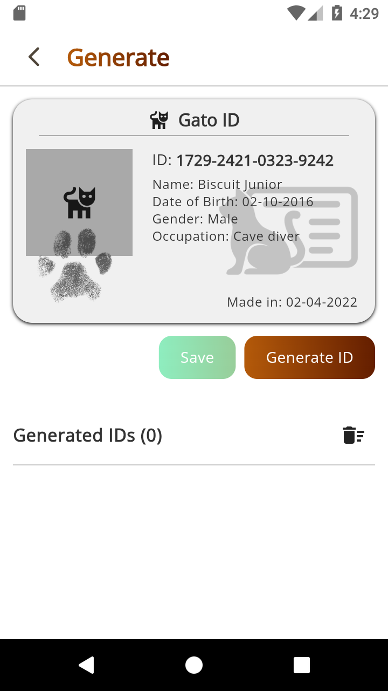
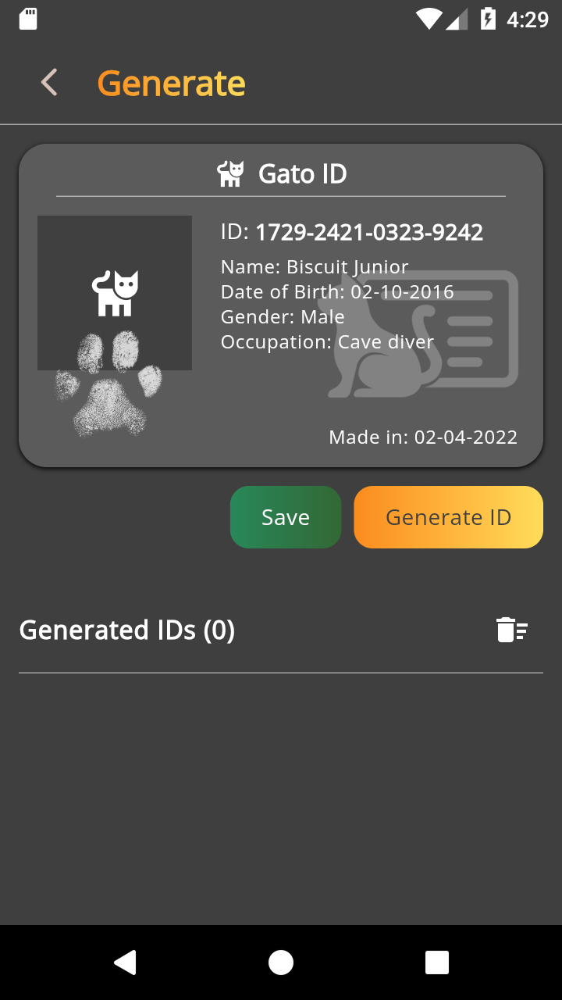
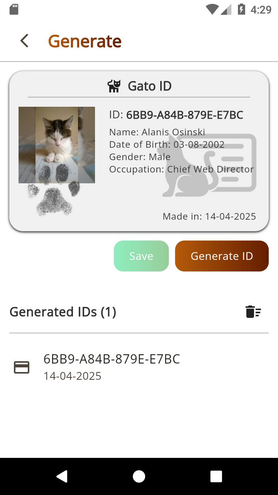
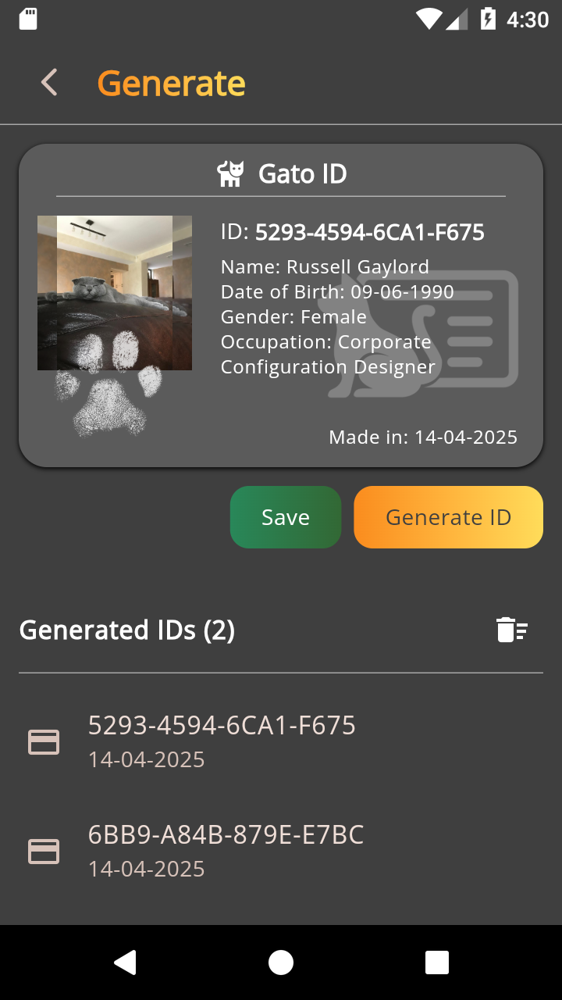
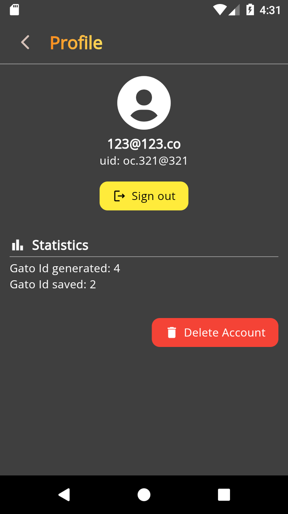

<a id="readme-top"></a>

<!-- Icon -->
<p align="center">
    </img>
</p>

<!-- Title & Description -->
<h1 align="center"> [Gato Id Generator] </h1>
<p align="center">Generate id card... But for cats!</p>

<!-- Badges -->
<div align="center">
    </img>
    </img>
</div>

<br/>
est. read time: <b>4.5 minutes</b>
<br/>

<!-- TABLE OF CONTENTS -->
<details>
  <summary>Table of Contents</summary>
  <ol>
    <li><a href="#quick-start">Quick Start</a></li>
    <li>
      <a href="#about-the-project">About The Project</a>
      <ul>
        <li><a href="#built-with">Built With</a></li>
      </ul>
    </li>
    <li>
      <a href="#getting-started">Getting Started</a>
      <ul>
        <li><a href="#prerequisites">Prerequisites</a></li>
        <li><a href="#installation">Installation</a></li>
      </ul>
    </li>
    <li><a href="#usage">Usage</a></li>
    <li><a href="#contributing">Contributing</a></li>
    <li><a href="#license">License</a></li>
    <li><a href="#contact">Contact</a></li>
    <li><a href="#acknowledgments">Acknowledgments</a></li>
  </ol>
</details>

<!-- QUICK START -->
## Quick Start
Currently, this app only supports for **Android**. I am unable to test the app for iOS platform, since I don't have any apple device.

[Download latest version here.](https://github.com/Daniel-C-J/gato-id-generator/releases)


<!-- ABOUT THE PROJECT -->
## About The Project

This project, **Gato Id Generator**, is an application intended for the purpose of showcasing my flutter skills. 

*Yeah, it's a dumb app, I know. But here I'm focusing on the functionality and the tech stacks within my range --humbly ;).* 

This is a Gato (Cat in spanish) Id generator app. One click, one cat picture, one identity. But before that, you have to login, but fret not, there's an option to run this locally using local backend within your operating system control instead of third party's.


### Architecture

I was using a different kind of approach when it's coming to architecture for this app, particularly about the *layer-first* approach, a.k.a classic and boring mvvm instead of the usual *feature-first* approach. So this app's architecture in a nutshell is like this:
```
├─core
|
├─data
│  ├─model
│  └─repository
|
├─domain
│  ├─repository
│  └─use_case
|
├─presentation
│  ├─generate (feature)
│  │  ├─bloc
│  │  └─view
|  |
│  └─_common_widgets
|
└─util
```
More or less like that :D.


### Features

- Authentication
- Generation
- Saving (Locally in gallery)
- Mini statistics 
- Classic light & dark theme

</img>
</img>
</img>
</img>

<p align="right">(<a href="#readme-top">back to top</a>)</p>


### Built With

</img>

With main dependencies such as:
- [BLoC](https://pub.dev/packages/bloc)
- [GetIt](https://pub.dev/packages/get_it)
- [GoRouter](https://pub.dev/packages/go_router)
- Firebase (Auth & Firestore)
- [Dio](https://pub.dev/packages/dio)
- [Hive](https://pub.dev/packages/hive_ce)
- [Localization](https://pub.dev/packages/easy_localization)

[See Changelog](./CHANGELOG.md)

<p align="right">(<a href="#readme-top">back to top</a>)</p>


<!-- GETTING STARTED -->
## Getting Started

Wanna build the fresh one instead? Sure follow these steps.

### Prerequisites

To avoid incompatibility, it is recommended that at least you have flutter's engine with version of **3.29.2** (stable). Here's how to check yours.

```sh
flutter --version
```

Also do check whether there's anything wrong with the engine.

```sh
flutter doctor -v
```

Next, if you choose firebase as the backend, initialize your firebase.

```sh
firebase login
```

Alternatively, you can use supabase, just make sure that your project's auth is configured to not **confirm/verify** email address yet, since this app is just a demo.

### Installation


1. Clone this repository 
```sh
git clone https://github.com/Daniel-C-J/gato-id-generator.git
```

2. Open your terminal and `cd` to the root path of the repository, for example:
```sh
cd gato-id-generator
```

3. Backend configuration. 
```sh
# If you're using firebase, you'll only be needing Auth & Firestore)
firebase init
flutterfire configure
```

```dart
// If you're using supabase you can go to app_startup_remote.dart under src/core/app/ then:
await Supabase.initialize(
    url: NetConsts.SUPABASE_URL, // <- Change this
    anonKey: NetConsts.SUPABASE_ANONKEY, // <- And this
);
// Or alternatively change both inside of network_constants file.
```

4. Type `flutter build --help` then head down to the `Available subcommands:` section, you'll be able to found the platform specific options to build the app. 
```sh
flutter build --help 
flutter build apk --release # If you choose to build android app.
```

5. The output path is usually in `./build`, for android specifically it is in `./build/app/outputs/flutter-apk/` alongside with the `sha-1` hash.
```sh
start . # To quickly opens file explorer to see for yourself the output.
```

6. And you're done! Congrats 🎉!
   
<p align="right">(<a href="#readme-top">back to top</a>)</p>


<!-- USAGE EXAMPLES -->
## Usage

This app is a really simple app, so there's no need for official documentation for it for now. As long as you have internet connection available, tap the generate button and wait for a moment, and you're good to go. 

</img>
</img>
</img>
  
And you can also view your mini profile with your mini statistics.

<p align="right">(<a href="#readme-top">back to top</a>)</p>


<!-- CONTRIBUTING -->
## Contributing

No, sadly I don't open to any contributions yet. Maybe next time.

Yes, coffee is okay. (Greedy aren't I?)

[](https://ko-fi.com/P5P4L666F)


<p align="right">(<a href="#readme-top">back to top</a>)</p>


<!-- LICENSE -->
## License

Distributed under the [MIT License](./LICENSE).

<p align="right">(<a href="#readme-top">back to top</a>)</p>


<!-- CONTACT -->
## Contact

Daniel CJ - dcj.dandy800@passinbox.com

Project Link: [https://github.com/Daniel-C-J/gato-id-generator](https://github.com/Daniel-C-J/gato-id-generator)


<p align="right">(<a href="#readme-top">back to top</a>)</p>


<!-- ACKNOWLEDGMENTS -->
## Acknowledgments

- The icon is just a combined version of two icons that both came from flaticons. 
- The cat and the dog image at Homescreen came from internet randomly.
- Cat generated pictures came directly from [here](https://cataas.com/cat).
- Remote id pictures are saved temporarily in [here](https://catbox.moe).
  
<p align="right">(<a href="#readme-top">back to top</a>)</p>
